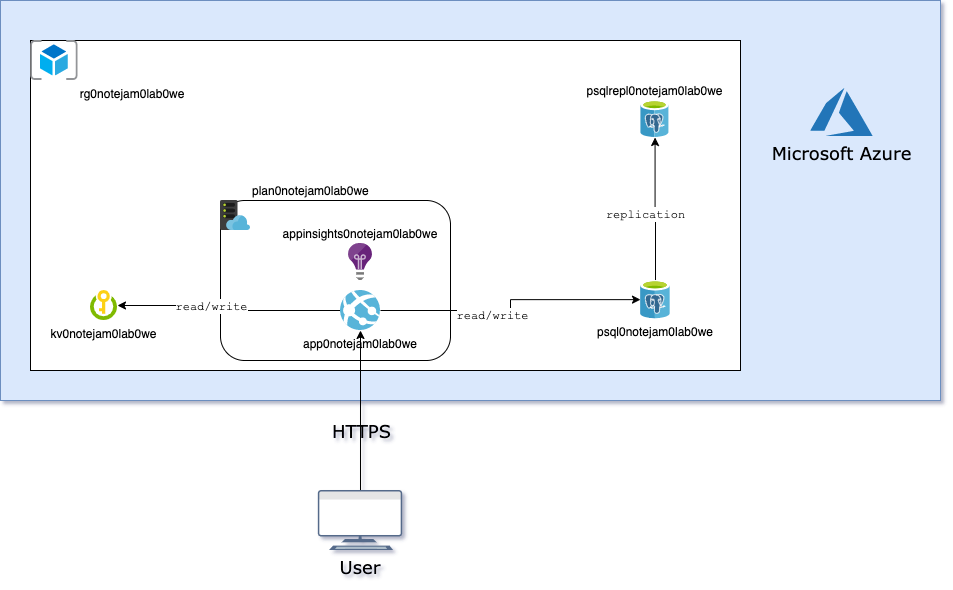
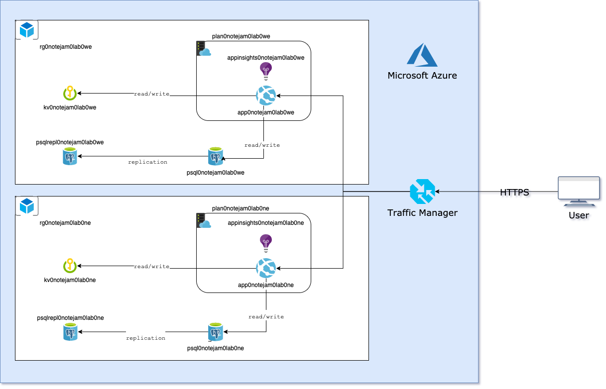
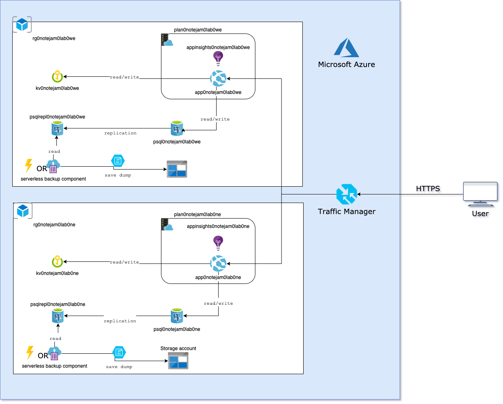
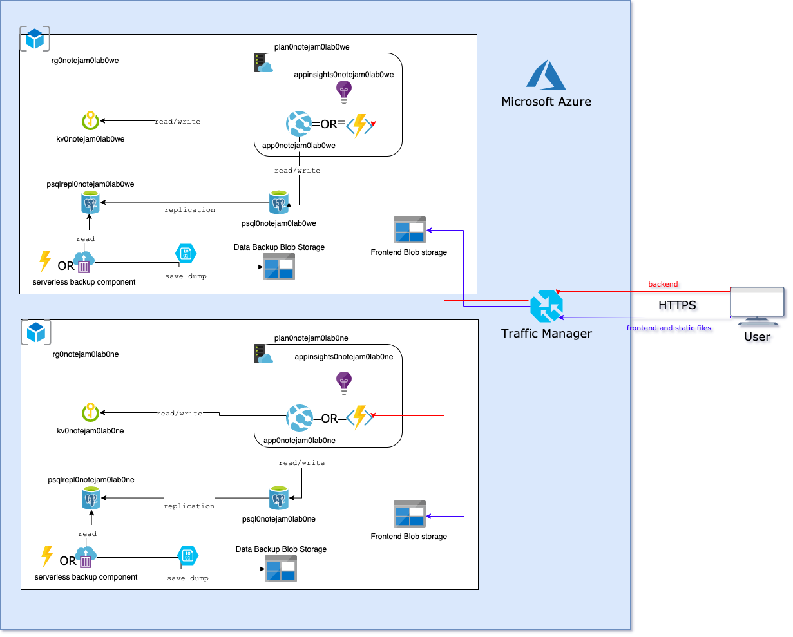
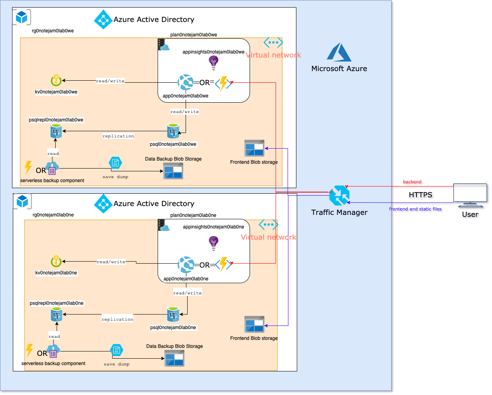

# Introduction

## Migration plan
For this task I recommend few steps of moving from on-prem evnironment to cloud. I choosed Azure Cloud, because I have more experience in using it.

### Step 1: Separete application and database (change DB from SQlite to PostgreSQL) and move to cloud.

> This step is done on master branch in this repository.

- Azure App Service
- Azure Database for PostgreSQL

Thanks to migration to Azure App Service client could achieve first business requirement. Application could serve variable amount of traffic because App Service has ability to scale both horizontaly and verticaly.

### Step 2: Prepare failover

- Azure Traffic Manager for failover.
- Resources in two different regions (eg. West Europe and North Europe)

By adding one component (traffic manager) client could achieve next goal - continuity in service in case of datacenter failures. Mirroring to the another datacenter will be easy thanks to IaaC concept and prepared terraform files - next goal checked.

### Step 3: Soft delete and backup database

- Because customer has guarantee to get notes from past up to 3 years - use soft delete (set date of deletion in database but don't delete record)
- There is need to store database dumps. To achieve it blob storage and some serverless component (ACI or Function), which would be able to make database backup dump, could be used.

### Step 4: Divide application on backend and frontend code. Prepare CI/CD pipelines.

- Frontend on Storage
- Backend could be rewrite to Functions or stay on App Service.
- Azure Devops for CI/CD

After this step developer work on this project will be much more easier and pleasant. Different teams could work on different repositories (backend and frontend, or when new domain comes, backend could be divided to work on separeted microservices). Azure Devops will help automate builds and deployments and thanks to deployment slots on Azure, it will happen with zero downtime.

### Step 5: Rethink tech stack

Move backend to TypeScript, work on code architecture more (divide application on layers: data provider repositories, business logic services, api views).

Good project infrastructure and clean code is a key to high quality service. TypeScript has types - it will help to find mistakes during writing code, not like Javasciprt - during runtime.

### Step 6: Utilize more cloud components.

- Azure Active Directory for user management
- Azure Virtual Network to "hide" database from public internet and hide communicatation between application and database in private network
- Move to CosmosDB - depends on postgres utility and speed and also costs of backups and replicatiions

If clients business will scale - infrastructure could too. Utilize more cloud components to make your product better and to simplify developers and ops lifes.

