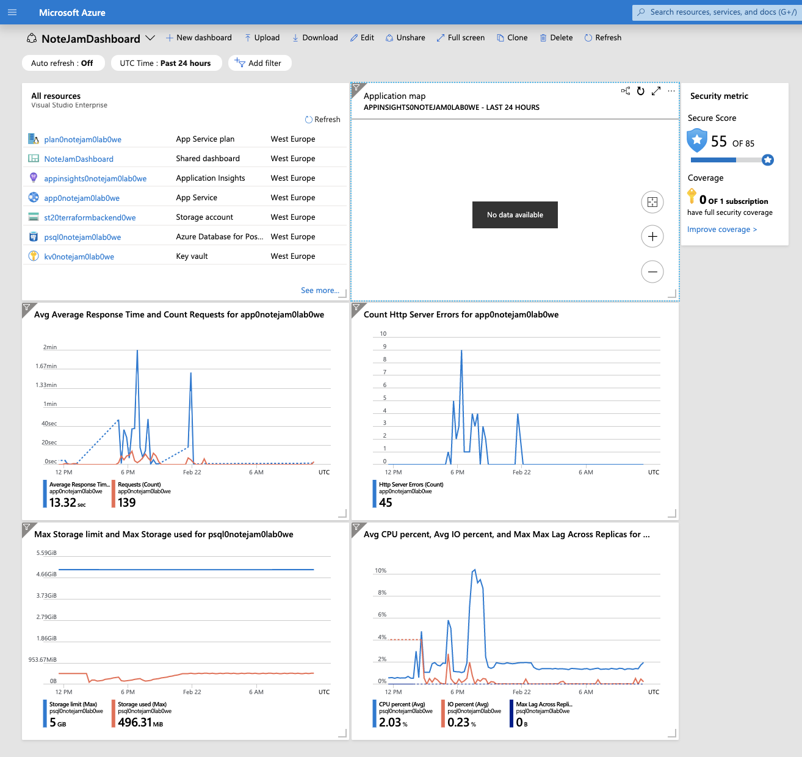

# Introduction

## Migration plan
For this task, I recommend a few steps of moving from an on-prem environment to a cloud. I chose Azure Cloud because I have more experience in using it.

### Step 1: Separate application and database (change DB from SQlite to PostgreSQL) and move to the cloud.

> This step is done on the master branch in this repository.

- Azure App Service
- Azure Database for PostgreSQL

Thanks to migration to Azure App Service client could achieve the first business requirement. The application could serve a variable amount of traffic because App Service has the ability to scale both horizontally and vertically.

Migration from SQLite to PostgreSQL is described [here](./db.md)

Furthermore, there is a prepared dashboard to watch metrics from the client applications.

### Step 2: Prepare failover

- Azure Traffic Manager to distribute load across regions.
- Resources in two different regions (eg. West Europe and North Europe)

By adding one component (Traffic Manager) client could achieve the next goal - continuity in service in case of data center failures. Mirroring to another datacenter will be easy thanks to the IaaC concept and terraform files - next goal checked.

### Step 3: Soft delete and backup database

- Because the customer has guaranteed to get notes from past up to 3 years, the application could use soft delete (set date of deletion in the database but don't delete a record)
- There is need to store database dumps. To achieve it blob storage and some serverless component (ACI or Function), which would be able to make database backup dump, could be used.

### Step 4: Divide application on backend and frontend code. Prepare CI/CD pipelines.

- Frontend on Storage (or on another App Service in the same plan)
- Backend could be rewritten to Functions or stay on App Service.
- Azure DevOps for CI/CD

After this step developer work on this project will be much easier and pleasant. Different teams could work on different repositories (backend and frontend, or when new domain comes, backend could be divided to work on separated microservices). Azure DevOps will help automate builds and deployments and thanks to deployment slots on Azure, it will happen with zero downtime.

### Step 5: Rethink tech stack

Move backend to TypeScript, work on code architecture more (divide the application into layers: data provider repositories, business logic services, API views, use IoC for testable code).

Good project infrastructure and clean code is key to high-quality service. TypeScript has types - it will help to find mistakes during writing code, not like Javasciprt - during runtime. Furthermore, because of layered/onion architecture, the team could work on different tasks without problems with merging their changes.

To manage features and deployments on a code side I recommend git flow.

### Step 6: Utilize more cloud components.

- Azure Active Directory for user management
- Azure Virtual Network to "hide" database from public internet and hide the communication between application and database in private network
- Move to CosmosDB - depends on Postgres utility and speed and also costs of backups and replications

If clients' business will scale - infrastructure could too. Utilize more cloud components to make your product better and to simplify developers and ops lives.

